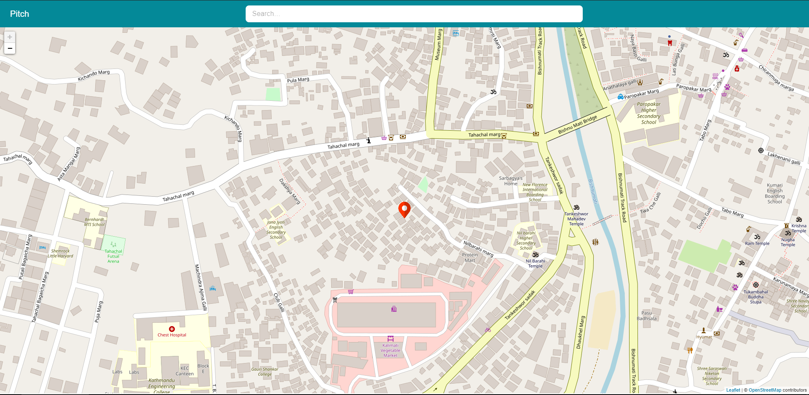
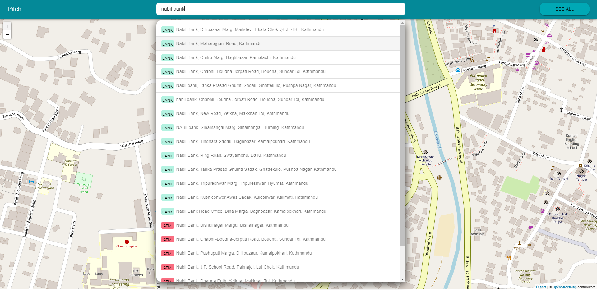
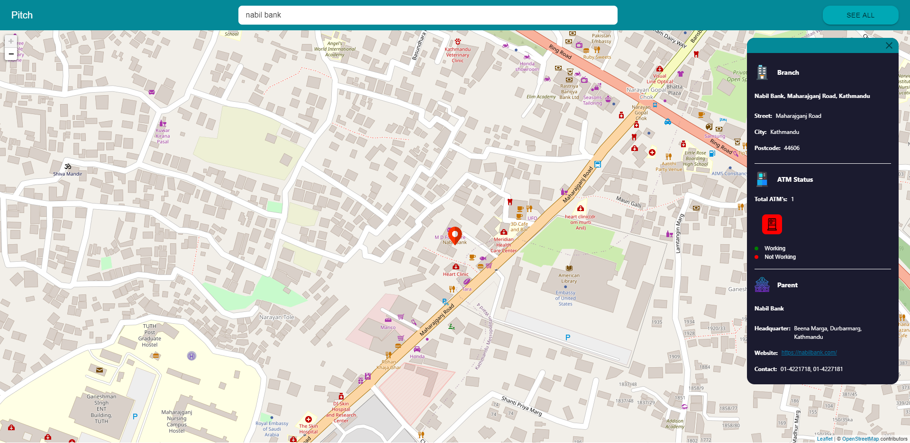
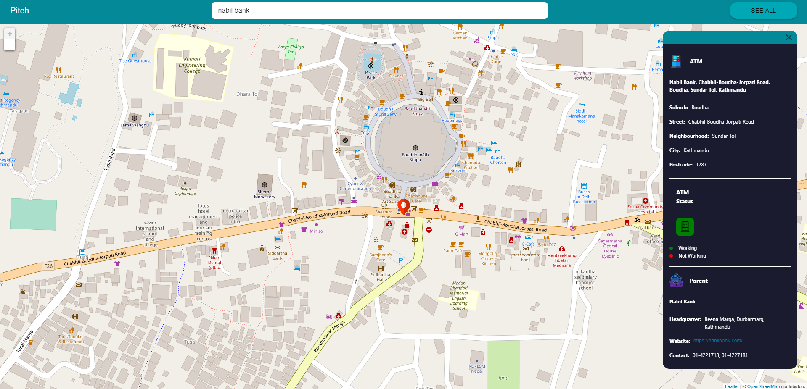
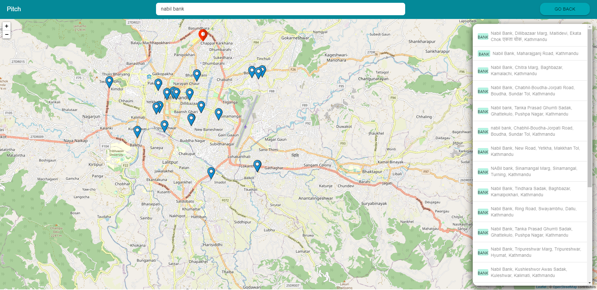

# Branch and ATM finder with ATM Status Check- Full Stack Application

This application helps to find different branches of banks by their location, see total number of ATM's in that particular branch along with their status(i.e. Working or Not Working) as well as different ATM's that are independent of branches with their statuses too.

NOTE: The number of ATM's in a branch and their statuses is arbitrary. These information are only known to banks particularly the ATM status. Nevertheless the project can display if there's someway to have that information. Currently its unknown so its only a mockup.

[Demo](https://pitch-version1.herokuapp.com/)

## Backend:
#### -Python(Django)
#### -Django REST Framework
#### -PostgreSQL

## Frontend
#### -React
#### -Material UI
#### -Redux for state management

## Others
#### -[Nominatim](https://nominatim.org/release-docs/develop/) [OpenStreet](https://www.openstreetmap.org/) Map API for search
#### -Leaflet JS to display the map and location.

## Home

## Search
Search through bank name, branch name or ATM

## Info
After selecting a searches item it will display all the information related to it.

If its a branch it will display info about branch and its address and display it in the map. Additionally it will show number of ATM's in that branch and their statuses. And at last its parent bank and its info.

If its an ATM it will display like this.

Additionally if you like to know info about all of the branch or ATM's and filter precisely you can toggle See ALl at the right top.

